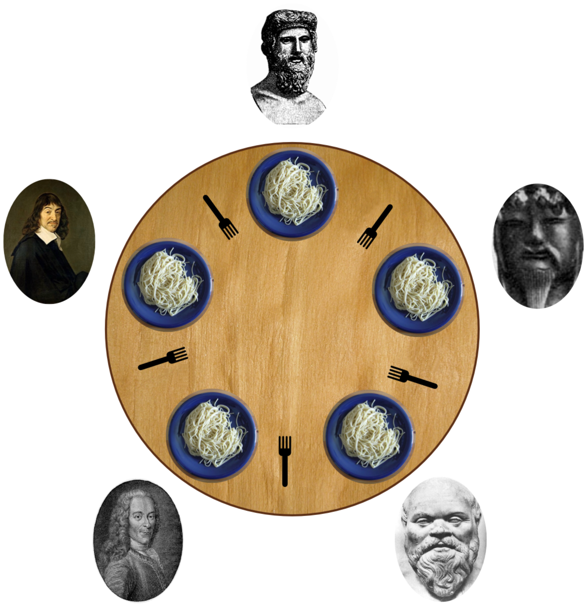

# 🍝 Philosophers



## 🧾 Project Overview

The `philosophers` project is a classic concurrency challenge based on the **Dining Philosophers Problem**, a theoretical problem used to illustrate synchronization issues in concurrent programming. The goal is to simulate a group of philosophers sitting around a table, eating, thinking, and competing for limited resources (forks), while avoiding **deadlocks**, **race conditions**, and **starvation**.

## 🎯 Objective

- Simulate multiple philosophers who:
  - Take two forks to eat
  - Think and sleep between meals
  - Die if they don’t eat in time
- Ensure:
  - No deadlock
  - No data races
  - Philosophers either eat, sleep, or think
  - Proper synchronization of shared data

## 💡 Key Concepts Learned

- Multithreading with **pthreads**
- Thread synchronization using **mutexes**
- Time management in concurrent systems
- Avoiding deadlocks and starvation
- Safe access to shared resources

## 🛠️ Technologies Used

- Language: C
- Library: pthread (POSIX Threads)
- Tools: Mutexes, timestamps, and thread-safe I/O
- Compilation: Makefile

## 🕹️ How It Works

- Each philosopher is a thread.
- Shared forks are protected with mutexes.
- A monitor thread checks for philosopher death or completion.
- Timings (e.g., time_to_die, time_to_eat, time_to_sleep) are passed as arguments.

## ⚙️ Example Run

```bash
./philo 5 800 200 200
